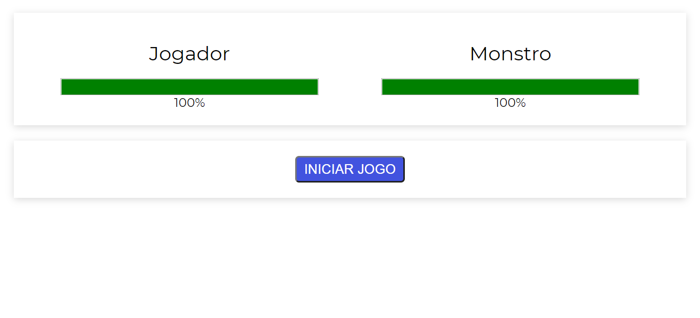
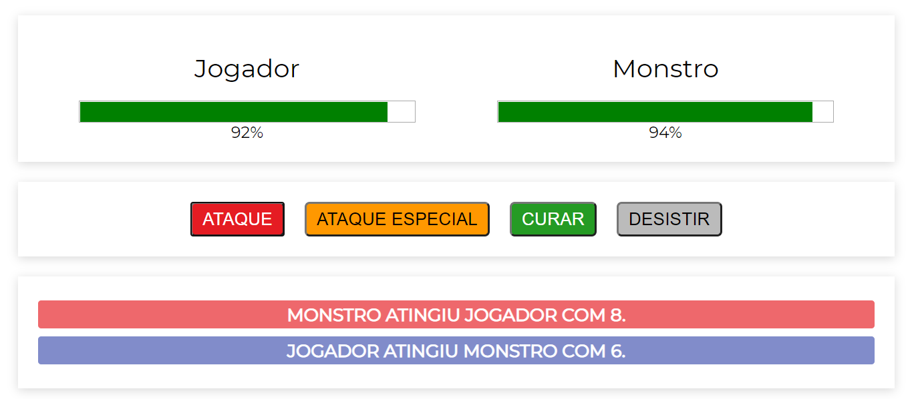
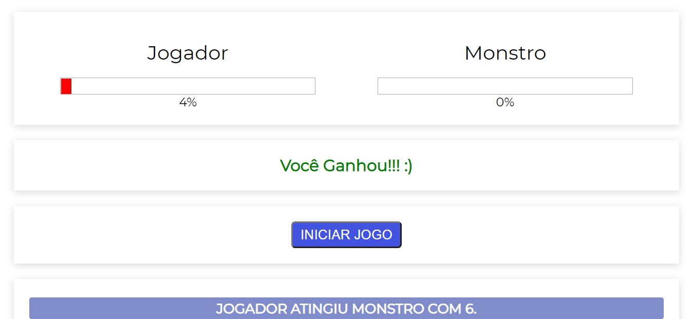
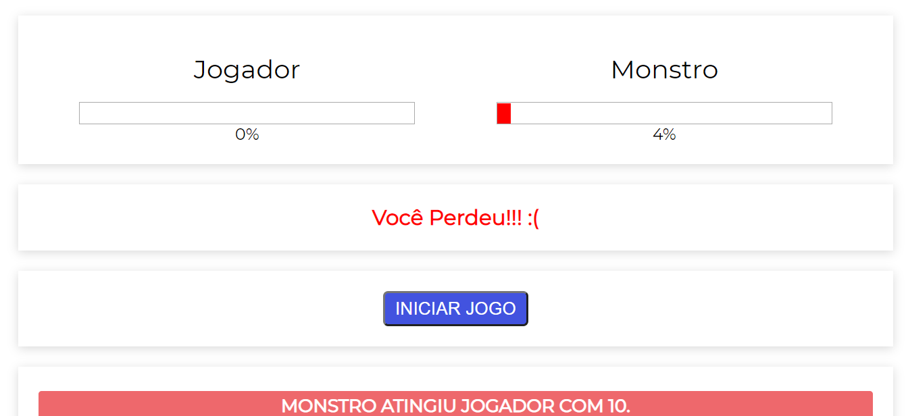

# O Matador de Monstros

### Descrição
  - Esse RPG é o primeiro projeto que eu desenvolvi em VueJS, o intúito desse projeto é vencer o mostro usando as habilidades presentes na tela

### Plataforma adotada
  WEB
  
### Linguagem
  JavaScript - VueJS
  
### Prints
## Iniciar Game
  
## Game
  
## Ganhou
  
## Perdeu
  
